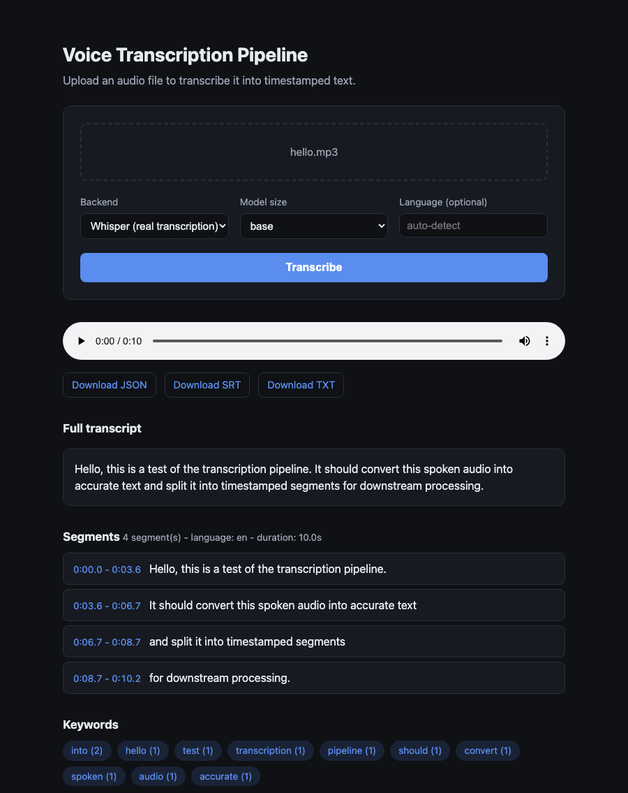

# Voice Converter: Audio to Text

A simple transcription pipeline that converts an audio file into text with
per-segment timestamps, and packages the result into formats other systems
can consume (JSON, SRT subtitles, plain text).

## Quickstart

```bash
python3 -m venv .venv
source .venv/bin/activate
pip install -r requirements.txt   # requires ffmpeg on PATH (brew install ffmpeg)

# Real transcription (downloads a Whisper model on first run)
python cli.py sample_audio/hello.mp3 --backend whisper --model-size base

# Deterministic, offline, no-download mode (useful for testing/demos)
python cli.py sample_audio/hello.wav --backend mock
```

Outputs are written to `output/<filename>.{json,srt,txt}` by default.

Run tests:

```bash
pytest
```

## Web UI

A small FastAPI app wraps the same `TranscriptionPipeline` used by the CLI
and exposes it as an upload-and-transcribe web page.

```bash
pip install -r requirements.txt   # adds fastapi/uvicorn/python-multipart
uvicorn web.app:app --reload
```

Then open http://127.0.0.1:8000. Upload an audio file, pick the `mock`
backend for an instant offline demo or `whisper` for real transcription,
and the page shows the full transcript, a clickable per-segment list that
seeks the audio player, extracted keywords, and download links for the
generated JSON/SRT/TXT files.



What you can do from this page:
- **Upload an audio file** - via the file picker or drag-and-drop (WAV, MP3, M4A, or anything ffmpeg can decode).
- **Choose the transcription backend** - `mock` for an instant, offline, deterministic run (no model download, good for demos/testing), or `whisper` for real speech-to-text.
- **Pick a Whisper model size** (`tiny`/`base`/`small`/`medium`) to trade off speed vs. accuracy, and optionally force a language code instead of relying on auto-detection.
- **Play back the uploaded audio** in-browser via the built-in `<audio>` player.
- **Browse timestamped segments** - each segment shows its start/end time and text; clicking one seeks the player to that point, and the active segment highlights automatically as playback progresses.
- **Read the full transcript** as a single cleaned block of text.
- **See extracted keywords** - a stopword-filtered word-frequency summary of the transcript, useful as an example of downstream tagging/search facets.
- **Download the result** as `.json` (structured segments + metadata), `.srt` (subtitles), or `.txt` (plain transcript) for use in other tools.

- [`web/app.py`](web/app.py) - the single `POST /api/transcribe` endpoint (accepts a file upload, runs the pipeline, returns the transcript JSON + file URLs) and static file serving. Whisper model instances are cached per `(model_size, device)` across requests so the model is only loaded once per server process.
- [`web/static/`](web/static) - plain HTML/CSS/JS frontend (no build step).

This is a demo server (uploads accumulate under `web/uploads/` and aren't
authenticated) - fine for local use, not for deploying as-is.

## Architecture

```
audio file --> audio_utils.probe_audio        (inspect format/duration)
           --> audio_utils.normalize_to_wav    (decode -> mono 16kHz WAV)
           --> audio_utils.iter_chunks         (split if long, with overlap)
           --> backends.TranscriptionBackend   (Whisper or Mock)
           --> pipeline._dedupe_overlapping_segments
           --> postprocess.TranscriptResult    (clean text, JSON/SRT/TXT, keywords)
```

- [`transcription_pipeline/audio_utils.py`](transcription_pipeline/audio_utils.py) - ffmpeg-backed format probing, normalization, and chunking.
- [`transcription_pipeline/backends.py`](transcription_pipeline/backends.py) - `TranscriptionBackend` interface, a real `faster-whisper` implementation, and a `MockBackend` for offline/deterministic use.
- [`transcription_pipeline/pipeline.py`](transcription_pipeline/pipeline.py) - orchestrates the steps above and merges chunked results.
- [`transcription_pipeline/postprocess.py`](transcription_pipeline/postprocess.py) - structured output (JSON/SRT/TXT) and a small keyword-extraction pass as an example downstream consumer.
- [`cli.py`](cli.py) - command-line entrypoint.

## Design decisions (answers to the problem statement's questions)

**How do you handle different audio formats?**
Every input is funneled through one `ffmpeg` conversion step
(`audio_utils.normalize_to_wav`) that decodes whatever container/codec was
given (mp3, m4a, flac, ogg, wav, ...) into a single canonical format - mono,
16kHz, 16-bit PCM WAV. `ffprobe` is used first to validate the file has an
audio stream and to read its duration. Everything downstream (chunking, the
transcription backend) only ever has to deal with that one format, so format
support scales with ffmpeg's codec support rather than needing per-format
branches in the pipeline.

**How do you deal with long audio files?**
The normalized WAV is sliced into fixed-length chunks (`audio_utils.iter_chunks`,
default 5 minutes) with a small time overlap (default 5s) between consecutive
chunks so words aren't cut off at a boundary. Chunks are transcribed one at a
time and each chunk file is deleted immediately after use, so disk/memory
usage stays roughly constant regardless of total audio length instead of
growing with it. Segment timestamps from each chunk are offset by the
chunk's start time, then merged; segments that fall inside the overlap
region already covered by the previous chunk are dropped
(`pipeline._dedupe_overlapping_segments`) so the final segment list doesn't
contain duplicated/re-transcribed text. Files shorter than the chunk size
are transcribed in a single pass (no unnecessary slicing).

**Timestamps per segment.**
`faster-whisper` natively returns start/end timestamps per segment; the
pipeline offsets those by each chunk's absolute start time so timestamps in
the final output are relative to the original file, not the chunk.

**Downstream processing.**
`postprocess.TranscriptResult` normalizes whitespace, assembles a full-text
transcript, and can emit:
- `.json` - structured `{source_file, duration, language, segments[], keywords[]}` for programmatic consumers,
- `.srt` - standard subtitle format built directly from segment timestamps,
- `.txt` - plain full-text transcript.

A lightweight stopword-filtered word-frequency pass (`top_keywords`) is
included as an example of a further downstream step (e.g. tagging/search
facets) that consumes the cleaned transcript.

**Mock data / testing.**
`backends.MockBackend` implements the same `TranscriptionBackend` interface
as the real Whisper backend but requires no model download, network access,
or GPU - it deterministically generates one segment per N seconds of audio
based only on the WAV's duration. This keeps the rest of the pipeline
(chunking, merging, postprocessing, CLI, file I/O) fully testable offline;
see `tests/`, which synthesize sine-wave WAV files rather than depending on
committed audio fixtures.

## Trade-offs / things a production version would add

- Normalization currently decodes the whole file to WAV up front (simple,
  and fine for a "simple pipeline" of reasonable length); for very long
  (multi-hour) files, a fully streaming decode-and-chunk step would avoid
  writing one large intermediate WAV to disk.
- `faster-whisper`'s own VAD filtering is enabled, which already helps
  with silence-heavy long recordings; the explicit chunking here is mainly
  about bounding memory/latency and enabling incremental/parallel
  processing, not accuracy.
- No retry/error-recovery around a single bad chunk (e.g. corrupted audio
  mid-file) - a production system would isolate a chunk failure so one bad
  segment doesn't fail the whole job.
